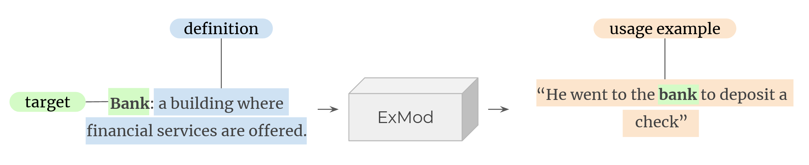

# :dark_sunglasses: ExMod

This repo contains a re-implementation of the original approach for Exemplification Modeling, i.e., the task
of generating usage examples given one or more words along with their textual definitions, presented by 
[Barba et al. (2021)](https://www.ijcai.org/proceedings/2021/520).



The repo currently focuses on k=1. A live demo is available at: 

If you find our work useful, please cite us with:

```
@inproceedings{ijcai2021-520,
  title     = {Exemplification Modeling: Can You Give Me an Example, Please?},
  author    = {Barba, Edoardo and Procopio, Luigi and Lacerra, Caterina and Pasini, Tommaso and Navigli, Roberto},
  booktitle = {Proceedings of the Thirtieth International Joint Conference on
               Artificial Intelligence, {IJCAI-21}},
  publisher = {International Joint Conferences on Artificial Intelligence Organization},
  editor    = {Zhi-Hua Zhou},
  pages     = {3779--3785},
  year      = {2021},
  month     = {8},
  note      = {Main Track}
  doi       = {10.24963/ijcai.2021/520},
  url       = {https://doi.org/10.24963/ijcai.2021/520},
}
```

## Installation

Requirements:
* Debian-based (e.g. Debian, Ubuntu, ...) system 
* [conda](https://docs.conda.io/en/latest/) installed

Run the following command to quickly setup the env needed to run our code:
```bash
bash setup.sh
```

## Training

This repo builds on top of the [classy](https://sunglasses-ai.github.io/classy) framework. 
To train on custom datasets, please refer to its documentation. 

## Checkpoints

A checkpoint trained on SemCor, WNE and [Fews](https://aclanthology.org/2021.eacl-main.36/) (both source and target
language are English) is available for [download](https://drive.google.com/file/d/1KMvXUCtz1HnTkJWEzZdddtbqXXBPAkN7/view?usp=share_link). 

**Important:** the model is released as is after its fine-tuning on the afore-mentioned datasets, without any further
machinery but for beam decoding. Therefore, it may present **bias** issues and **ethical** concerns, and further 
mitigation strategies are needed.

Once you have downloaded the file, untar it inside the *experiments/* folder.

```
# move file to experiments folder
mv ~/Downloads/bart-semcor-wne-fews.tar.gz experiments/
# untar
tar -xf experiments/bart-semcor-wne-fews.tar.gz -C experiments/
rm experiments/bart-semcor-wne-fews.tar.gz
```


## Predict

There are two alternatives to perform predictions with the trained checkpoints:
* Directly through *classy*
* Through a Rest API

### Library

As this repo is built on top of **classy**, we can use its functionalities to perform the prediction. First, store your
data in the following format (**important**: the file must have *exmj* extension):
```bash
$ cat <path-to-input-file> | head -1 | jq
{
  "source_language": "en",
  "D": [
    [
      "dog",
      "a domestic animal"
    ]
  ],
  "target_language": "en"
}
```
*D* is a list of lemma-definition pairs (as mentioned above, for the time being, len(D) must always be 1).

Then:
```bash
$ classy predict file <path-to-ckpt> <path-to-input-file> -o <path-to-output-file> --prediction-params configurations/prediction-params/beam.yaml
$ cat <path-to-output-file> | head -1 | jq
{
  "source_language": "en",
  "D": [
    [
      "dog",
      "a domestic animal"
    ]
  ],
  "target_language": "en",
  "s": "The dog was lying on the floor, his head on his paws.",
  "phi": [
    [
      4,
      5,
      6
    ]
  ]
}
```
Here, *s* represents the generated example, while *phi* is a list with as many items as *D* such that *phi[0]* denotes
the character positions where *D[0]* has been exemplified in *s*.

### Rest API

To query via the Rest API, it's possible to either spawn the server directly or through Docker:
* Directly:
    ```bash
    $ classy serve <path-to-ckpt> --prediction-params configurations/prediction-params/beam.yaml
    $ curl -X 'POST' http://localhost:8000/ -H 'accept: application/json' -H 'Content-Type: application/json' -d '[{"source_language": "en", "D": [["dog", "a domestic animal"]], "target_language": "en"}]'
    [
      {
        "source_language": "en",
        "D": [
          [
            "dog",
            "a domestic animal"
          ]
        ],
        "target_language": "en",
        "s": "The dog was lying on the floor, his head on his paws.",
        "phi": [
          [
            4,
            5,
            6
          ]
        ]
      }
    ]
    ```
* Through Docker:

## Acknowledgments

This work was supported by Sapienza University of Rome under the grant "Avvio alla Ricerca (Tipo 1) 2021".